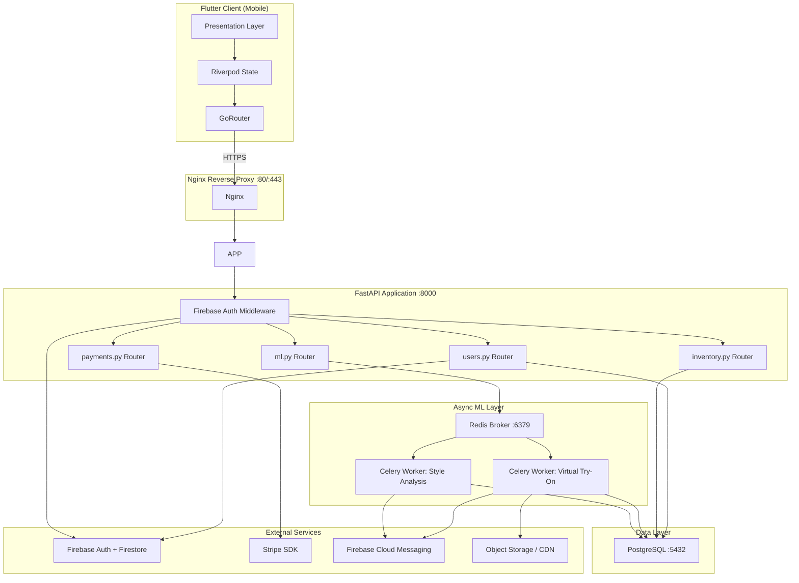
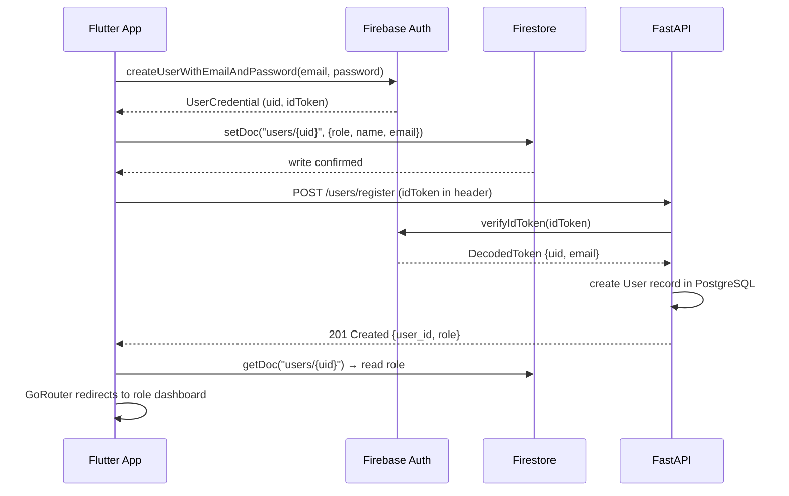
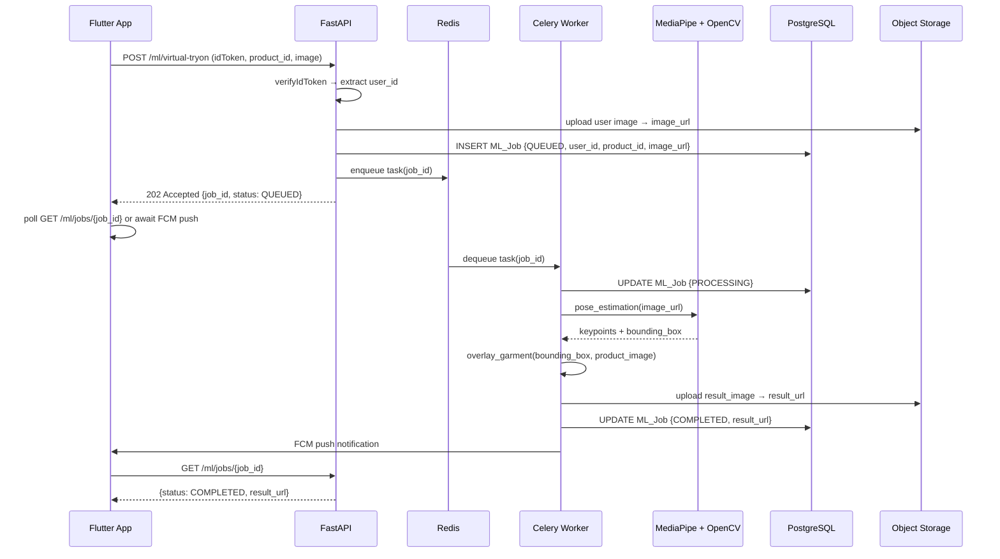
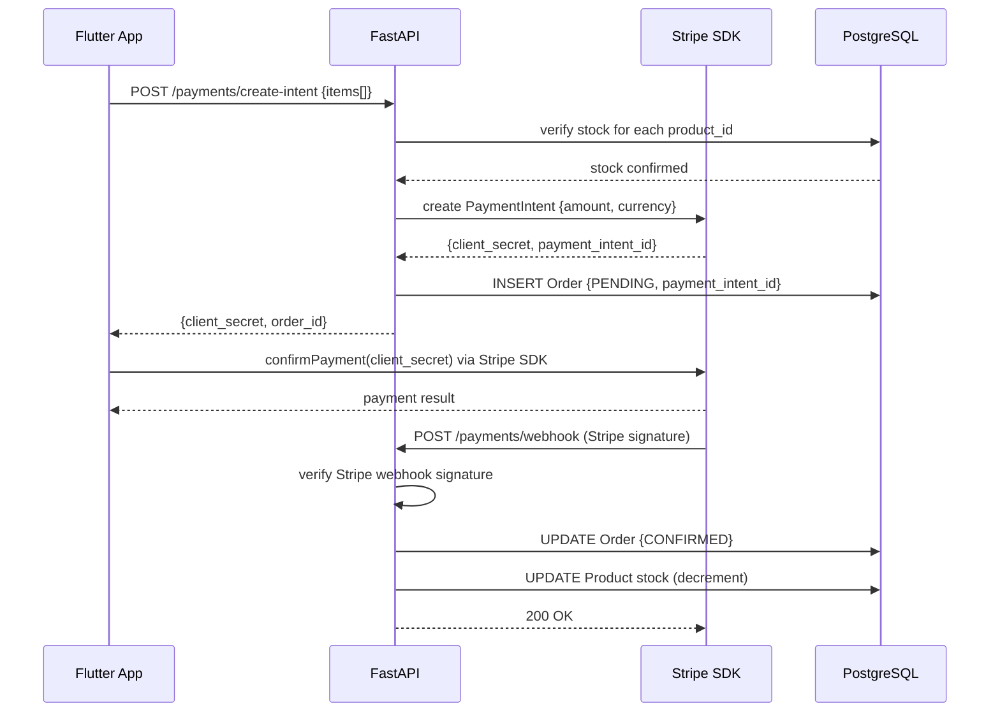
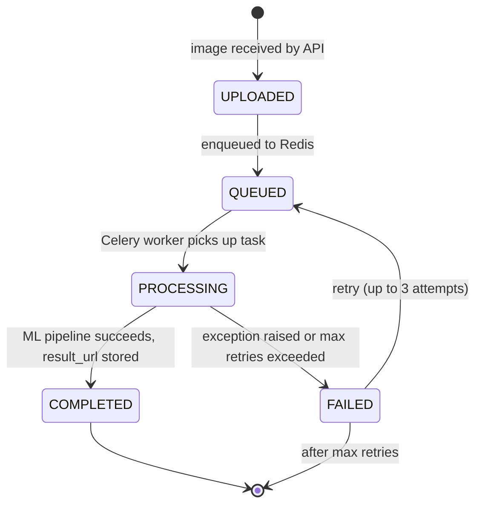

# Design Document: Style With Us

## Overview

Style With Us is a premium AI-powered fashion-tech platform that addresses the core problem of online retail returns by enabling shoppers to visualize clothing on their own bodies before purchasing. The system accepts user-provided body photos, runs ML-powered body shape classification and skin tone analysis, and composites digital garments onto the user's image via MediaPipe Pose Estimation and OpenCV — all delivered through a Flutter mobile client backed by a Python FastAPI service.

The platform is built for three distinct user roles (Shopper, Brand Partner, System Admin) and unifies AI analysis, virtual try-on, augmented reality try-on, inventory management, and Stripe-powered checkout into a single cohesive experience. Heavy ML workloads are decoupled from the request cycle via Celery workers and a Redis message broker, ensuring the core API remains responsive while compute-intensive tasks run asynchronously.

The architecture follows a strict separation of concerns: the Flutter client handles presentation and state (Riverpod + GoRouter), FastAPI handles business logic and auth (Firebase JWT verification), Celery workers handle ML pipelines, PostgreSQL stores structured data, and external services (Firebase, Stripe, Firestore) handle auth, payments, and real-time role data respectively.

---

## Architecture



---

## Sequence Diagrams

### User Registration & Role-Based Redirect



### Virtual Try-On Flow



### Checkout Flow



---

## Components and Interfaces

### Component 1: FastAPI Application Server

**Purpose**: Core business logic layer — validates Firebase JWTs, routes requests, coordinates ML job dispatch, and serves inventory/payment operations.

**Interface**:
```python
# Auth middleware applied globally
async def verify_firebase_token(authorization: str = Header(...)) -> DecodedToken:
    """Verifies Firebase JWT; raises 401 on invalid/expired token."""

# ml.py router
@router.post("/ml/style-analysis", response_model=MLJobResponse)
async def submit_style_analysis(
    request: StyleAnalysisRequest,
    user: DecodedToken = Depends(verify_firebase_token),
    db: AsyncSession = Depends(get_db),
) -> MLJobResponse: ...

@router.post("/ml/virtual-tryon", response_model=MLJobResponse)
async def submit_virtual_tryon(
    request: VirtualTryOnRequest,
    user: DecodedToken = Depends(verify_firebase_token),
    db: AsyncSession = Depends(get_db),
) -> MLJobResponse: ...

@router.get("/ml/jobs/{job_id}", response_model=MLJobStatus)
async def get_job_status(
    job_id: UUID,
    user: DecodedToken = Depends(verify_firebase_token),
    db: AsyncSession = Depends(get_db),
) -> MLJobStatus: ...

# inventory.py router
@router.get("/inventory/products", response_model=list[ProductResponse])
async def list_products(
    page: int = 1,
    page_size: int = 20,
    db: AsyncSession = Depends(get_db),
) -> list[ProductResponse]: ...

@router.post("/inventory/products", response_model=ProductResponse)
async def create_product(
    product: ProductCreate,
    user: DecodedToken = Depends(require_role("brand")),
    db: AsyncSession = Depends(get_db),
) -> ProductResponse: ...

# payments.py router
@router.post("/payments/create-intent", response_model=PaymentIntentResponse)
async def create_payment_intent(
    order: OrderCreate,
    user: DecodedToken = Depends(verify_firebase_token),
    db: AsyncSession = Depends(get_db),
) -> PaymentIntentResponse: ...

@router.post("/payments/webhook")
async def stripe_webhook(request: Request) -> dict: ...
```

**Responsibilities**:
- Verify Firebase ID tokens on every protected endpoint
- Enforce RBAC (Shopper/Brand/Admin role checks via `require_role` dependency)
- Enqueue ML tasks to Redis via Celery `apply_async`
- Delegate Stripe payment intent creation; never store raw card data
- Apply rate limiting via `slowapi` on `/ml/*` endpoints

---

### Component 2: Celery ML Workers

**Purpose**: Execute computationally heavy ML tasks (body shape classification, skin tone analysis, virtual try-on compositing) asynchronously, decoupled from the HTTP request cycle.

**Interface**:
```python
@celery_app.task(bind=True, max_retries=3, default_retry_delay=10)
def process_style_analysis(self, job_id: str, image_url: str) -> dict:
    """
    Runs ResNet50 body shape classification + Stone skin tone analysis.
    Updates ML_Job record on completion or failure.
    Returns: {"body_shape": str, "skin_tone": str, "confidence": float, "recommended_style_ids": list[str]}
    """

@celery_app.task(bind=True, max_retries=3, default_retry_delay=10)
def process_virtual_tryon(self, job_id: str, user_image_url: str, product_id: str) -> dict:
    """
    Runs MediaPipe pose estimation → keypoint extraction → OpenCV garment compositing.
    Uploads result image to object storage.
    Returns: {"result_url": str, "session_id": str}
    """
```

**Responsibilities**:
- Pull job_id from Redis queue and fetch full context from PostgreSQL
- Update ML_Job status through the state machine: QUEUED → PROCESSING → COMPLETED/FAILED
- Retry on transient failures (network, GPU OOM) up to 3 times
- Send FCM push notification on job completion
- Release resources cleanly on failure

---

### Component 3: Flutter Presentation Layer

**Purpose**: Renders role-specific dashboards, manages state with Riverpod, handles navigation with GoRouter, and provides camera/AR try-on interface.

**Interface**:
```dart
// State notifiers (Riverpod)
class AuthNotifier extends AsyncNotifier<UserSession?> {
  Future<void> signIn(String email, String password);
  Future<void> signUp(String email, String password, UserRole role);
  Future<void> signOut();
}

class TryOnNotifier extends AsyncNotifier<TryOnState> {
  Future<void> submitTryOn(String productId, File bodyPhoto);
  Future<void> pollJobStatus(String jobId);
}

class CartNotifier extends Notifier<CartState> {
  void addItem(Product product);
  void removeItem(String productId);
  void clearCart();
}

// GoRouter route definitions
final router = GoRouter(
  redirect: (context, state) => authGuard(context, state),
  routes: [
    GoRoute(path: '/login', builder: ...),
    GoRoute(path: '/shopper', builder: ..., routes: [
      GoRoute(path: 'try-on', builder: ...),
      GoRoute(path: 'ar-tryon', builder: ...),
      GoRoute(path: 'checkout', builder: ...),
    ]),
    GoRoute(path: '/brand', builder: ..., routes: [
      GoRoute(path: 'products', builder: ...),
      GoRoute(path: 'upload', builder: ...),
    ]),
    GoRoute(path: '/admin', builder: ...),
  ],
);
```

**Responsibilities**:
- Attach Firebase ID token to every API request via Dio interceptor
- Cache product images aggressively with `cached_network_image`
- Maintain 60 FPS by offloading heavy operations to isolates
- Drive AR try-on via camera feed + 2D garment overlay using `camera` package + Canvas

---

### Component 4: Firebase Auth + Firestore Integration

**Purpose**: Handles user identity (JWT issuance, token refresh) and stores role metadata for client-side route guarding.

**Responsibilities**:
- Issue and refresh Firebase ID tokens client-side
- Store `{uid, role, name, email}` in Firestore `users/{uid}`
- FastAPI backend verifies tokens using `firebase-admin` SDK (no session state server-side)
- FCM tokens stored in Firestore for push notification targeting

---

## Data Models

### SQLAlchemy ORM Models (PostgreSQL)

```python
import uuid
from datetime import datetime
from enum import Enum as PyEnum
from sqlalchemy import Column, String, Float, Integer, DateTime, ForeignKey, Enum
from sqlalchemy.dialects.postgresql import UUID
from sqlalchemy.orm import relationship, DeclarativeBase

class Base(DeclarativeBase):
    pass

class UserRole(PyEnum):
    SHOPPER = "shopper"
    BRAND = "brand"
    ADMIN = "admin"

class MLJobStatus(PyEnum):
    UPLOADED = "uploaded"
    QUEUED = "queued"
    PROCESSING = "processing"
    COMPLETED = "completed"
    FAILED = "failed"

class OrderStatus(PyEnum):
    PENDING = "pending"
    CONFIRMED = "confirmed"
    SHIPPED = "shipped"
    CANCELLED = "cancelled"

class User(Base):
    __tablename__ = "users"
    user_id: UUID = Column(UUID(as_uuid=True), primary_key=True, default=uuid.uuid4)
    firebase_uid: str = Column(String(128), unique=True, nullable=False, index=True)
    name: str = Column(String(255), nullable=False)
    email: str = Column(String(255), unique=True, nullable=False)
    role: UserRole = Column(Enum(UserRole), nullable=False, default=UserRole.SHOPPER)
    created_at: datetime = Column(DateTime, default=datetime.utcnow)
    orders = relationship("Order", back_populates="user")
    ml_jobs = relationship("MLJob", back_populates="user")

class Brand(Base):
    __tablename__ = "brands"
    brand_id: UUID = Column(UUID(as_uuid=True), primary_key=True, default=uuid.uuid4)
    user_id: UUID = Column(UUID(as_uuid=True), ForeignKey("users.user_id"), unique=True)
    company_name: str = Column(String(255), nullable=False)
    logo_url: str = Column(String(1024))
    products = relationship("Product", back_populates="brand")

class Product(Base):
    __tablename__ = "products"
    product_id: UUID = Column(UUID(as_uuid=True), primary_key=True, default=uuid.uuid4)
    brand_id: UUID = Column(UUID(as_uuid=True), ForeignKey("brands.brand_id"), nullable=False)
    sku: str = Column(String(100), unique=True, nullable=False)
    name: str = Column(String(255), nullable=False)
    description: str = Column(String(2000))
    price: float = Column(Float, nullable=False)
    stock_quantity: int = Column(Integer, nullable=False, default=0)
    image_url: str = Column(String(1024))
    brand = relationship("Brand", back_populates="products")

class Order(Base):
    __tablename__ = "orders"
    order_id: UUID = Column(UUID(as_uuid=True), primary_key=True, default=uuid.uuid4)
    user_id: UUID = Column(UUID(as_uuid=True), ForeignKey("users.user_id"), nullable=False)
    total_amount: float = Column(Float, nullable=False)
    status: OrderStatus = Column(Enum(OrderStatus), default=OrderStatus.PENDING)
    payment_intent_id: str = Column(String(255))
    created_at: datetime = Column(DateTime, default=datetime.utcnow)
    user = relationship("User", back_populates="orders")

class MLJob(Base):
    __tablename__ = "ml_jobs"
    job_id: UUID = Column(UUID(as_uuid=True), primary_key=True, default=uuid.uuid4)
    user_id: UUID = Column(UUID(as_uuid=True), ForeignKey("users.user_id"), nullable=False)
    job_type: str = Column(String(50), nullable=False)  # "style_analysis" | "virtual_tryon"
    status: MLJobStatus = Column(Enum(MLJobStatus), default=MLJobStatus.UPLOADED)
    input_image_url: str = Column(String(1024))
    result_url: str = Column(String(1024))
    error_message: str = Column(String(1024))
    created_at: datetime = Column(DateTime, default=datetime.utcnow)
    updated_at: datetime = Column(DateTime, onupdate=datetime.utcnow)
    user = relationship("User", back_populates="ml_jobs")
```

### Pydantic Request/Response Schemas

```python
from pydantic import BaseModel, HttpUrl, field_validator
from uuid import UUID
from typing import Optional

class StyleAnalysisRequest(BaseModel):
    image_url: HttpUrl

class VirtualTryOnRequest(BaseModel):
    product_id: UUID
    image_url: HttpUrl

    @field_validator("image_url")
    @classmethod
    def validate_image_url(cls, v: HttpUrl) -> HttpUrl:
        allowed = [".jpg", ".jpeg", ".png", ".webp"]
        if not any(str(v).lower().endswith(ext) for ext in allowed):
            raise ValueError("image_url must point to a supported image format")
        return v

class MLJobResponse(BaseModel):
    job_id: UUID
    status: str
    created_at: str

class MLJobStatus(BaseModel):
    job_id: UUID
    status: str
    result_url: Optional[str] = None
    error_message: Optional[str] = None

class AIAnalysisResult(BaseModel):
    body_shape: str          # "hourglass" | "pear" | "apple" | "rectangle" | "inverted_triangle"
    skin_tone: str           # Stone library output palette
    confidence_score: float  # 0.0–1.0
    recommended_style_ids: list[str]

class ProductCreate(BaseModel):
    sku: str
    name: str
    description: Optional[str]
    price: float
    stock_quantity: int
    image_url: Optional[HttpUrl]

    @field_validator("price")
    @classmethod
    def price_must_be_positive(cls, v: float) -> float:
        if v <= 0:
            raise ValueError("price must be greater than zero")
        return v

class ProductResponse(ProductCreate):
    product_id: UUID
    brand_id: UUID

class OrderCreate(BaseModel):
    items: list[dict]  # [{product_id, quantity}]

class PaymentIntentResponse(BaseModel):
    client_secret: str
    order_id: UUID
    total_amount: float
```

**Validation Rules**:
- `price` must be greater than 0
- `stock_quantity` must be ≥ 0
- `image_url` must use HTTPS and point to a supported image format
- `role` must be one of: `shopper`, `brand`, `admin`
- `confidence_score` must be in range [0.0, 1.0]
- `firebase_uid` must be unique per user record

---

## Algorithmic Pseudocode

### ML Job State Machine



### Algorithm 1: Style Analysis Pipeline

```python
ALGORITHM process_style_analysis(job_id: str, image_url: str) -> AIAnalysisResult

INPUT:
    job_id: UUID string of the ML_Job record
    image_url: HTTPS URL to a full-body photo in object storage

OUTPUT:
    AIAnalysisResult with body_shape, skin_tone, confidence_score, recommended_style_ids

PRECONDITIONS:
    - job_id references an existing ML_Job with status QUEUED
    - image_url is accessible and points to a valid image (JPEG/PNG/WebP)
    - PyTorch ResNet50 model weights are loaded and available
    - Stone library is initialized

POSTCONDITIONS:
    - ML_Job record status is COMPLETED with result populated
    - AIAnalysisResult.confidence_score ∈ [0.0, 1.0]
    - AIAnalysisResult.body_shape ∈ {"hourglass", "pear", "apple", "rectangle", "inverted_triangle"}
    - No side effects on input image (read-only)

LOOP INVARIANTS:
    - For each style_id in recommended_style_ids: style_id references a valid Product

BEGIN
    db.update_job(job_id, status=PROCESSING)

    # Step 1: Load and preprocess image
    image_bytes = fetch_image(image_url)           # HTTP GET with timeout=30s
    image_tensor = preprocess_for_resnet(image_bytes)
    # preprocess: resize to 224×224, normalize (mean=[0.485,0.456,0.406], std=[0.229,0.224,0.225])

    # Step 2: Body shape classification via ResNet50
    WITH torch.no_grad():
        logits = resnet50_model(image_tensor.unsqueeze(0))
        probabilities = softmax(logits, dim=1)
        body_shape_idx = argmax(probabilities)
        confidence = probabilities[body_shape_idx].item()

    ASSERT 0.0 <= confidence <= 1.0
    body_shape = BODY_SHAPE_CLASSES[body_shape_idx]   # index → label mapping

    # Step 3: Skin tone analysis via Stone library
    skin_tone = stone.process(image_bytes, image_type="body").dominant_colors[0].hex

    # Step 4: Recommendation lookup (rule-based + similarity)
    recommended_style_ids = lookup_styles(body_shape, skin_tone)
    ASSERT len(recommended_style_ids) >= 1

    result = AIAnalysisResult(
        body_shape=body_shape,
        skin_tone=skin_tone,
        confidence_score=confidence,
        recommended_style_ids=recommended_style_ids,
    )

    db.update_job(job_id, status=COMPLETED, result=result.model_dump_json())
    fcm.notify(user_id=job.user_id, title="Style Analysis Ready", body="View your results")

    RETURN result

ON EXCEPTION AS e:
    db.update_job(job_id, status=FAILED, error_message=str(e))
    IF retry_count < MAX_RETRIES:
        raise self.retry(exc=e)
    RAISE e
END
```

### Algorithm 2: Virtual Try-On Pipeline

```python
ALGORITHM process_virtual_tryon(job_id: str, user_image_url: str, product_id: str) -> VirtualTryOnResult

INPUT:
    job_id: UUID string of the ML_Job record
    user_image_url: HTTPS URL to full-body photo
    product_id: UUID string of the target Product

OUTPUT:
    VirtualTryOnResult with result_url and session_id

PRECONDITIONS:
    - ML_Job with job_id exists and has status QUEUED
    - user_image_url is accessible and contains a visible human figure
    - product_id references an existing Product with a non-null image_url
    - MediaPipe Pose model is initialized (mp.solutions.pose)
    - OpenCV is available

POSTCONDITIONS:
    - result_url points to a composite image in object storage (HTTPS)
    - ML_Job status updated to COMPLETED with result_url stored
    - Input images are unchanged (immutable inputs)
    - Composite image dimensions match input user_image dimensions

LOOP INVARIANTS:
    - For each keypoint in pose_keypoints: keypoint.visibility ∈ [0.0, 1.0]

BEGIN
    db.update_job(job_id, status=PROCESSING)

    # Step 1: Fetch images
    user_img = cv2.imdecode(fetch_image(user_image_url))     # BGR numpy array (H, W, 3)
    product_img = cv2.imdecode(fetch_image(product.image_url))  # garment with alpha channel

    height, width = user_img.shape[:2]

    # Step 2: MediaPipe Pose Estimation
    WITH mp.solutions.pose.Pose(
        static_image_mode=True,
        model_complexity=1,
        min_detection_confidence=0.5
    ) AS pose:
        rgb_img = cv2.cvtColor(user_img, cv2.COLOR_BGR2RGB)
        results = pose.process(rgb_img)

        IF results.pose_landmarks IS NULL:
            RAISE PoseDetectionError("No human pose detected in image")

        landmarks = results.pose_landmarks.landmark
        # Extract torso keypoints for garment bounding box
        left_shoulder  = landmarks[mp.solutions.pose.PoseLandmark.LEFT_SHOULDER]
        right_shoulder = landmarks[mp.solutions.pose.PoseLandmark.RIGHT_SHOULDER]
        left_hip       = landmarks[mp.solutions.pose.PoseLandmark.LEFT_HIP]
        right_hip      = landmarks[mp.solutions.pose.PoseLandmark.RIGHT_HIP]

        ASSERT ALL keypoint.visibility >= 0.3 FOR keypoint IN [left_shoulder, right_shoulder, left_hip, right_hip]

    # Step 3: Compute garment bounding box (pixel coordinates)
    x1 = int(min(left_shoulder.x, right_shoulder.x) * width)
    y1 = int(min(left_shoulder.y, right_shoulder.y) * height)
    x2 = int(max(left_hip.x, right_hip.x) * width)
    y2 = int(max(left_hip.y, right_hip.y) * height)

    bounding_box = BoundingBox(x1=x1, y1=y1, x2=x2, y2=y2)
    ASSERT bounding_box.width > 0 AND bounding_box.height > 0

    # Step 4: Resize and composite garment
    garment_resized = cv2.resize(product_img, (bounding_box.width, bounding_box.height))

    IF garment_resized has alpha channel:
        alpha = garment_resized[:, :, 3] / 255.0      # normalize to [0,1]
        FOR c IN [0, 1, 2]:                            # blend each BGR channel
            user_img[y1:y2, x1:x2, c] = (
                alpha * garment_resized[:, :, c] +
                (1 - alpha) * user_img[y1:y2, x1:x2, c]
            )
    ELSE:
        user_img[y1:y2, x1:x2] = garment_resized

    # Step 5: Encode and upload result
    _, img_buffer = cv2.imencode(".jpg", user_img, [cv2.IMWRITE_JPEG_QUALITY, 92])
    result_url = storage.upload(img_buffer.tobytes(), content_type="image/jpeg")

    session_id = str(uuid.uuid4())
    result = VirtualTryOnResult(result_url=result_url, session_id=session_id)

    db.update_job(job_id, status=COMPLETED, result_url=result_url)
    fcm.notify(user_id=job.user_id, title="Your Try-On Is Ready!", body="Tap to view your look")

    RETURN result

ON EXCEPTION AS e:
    db.update_job(job_id, status=FAILED, error_message=str(e))
    IF retry_count < MAX_RETRIES:
        raise self.retry(exc=e)
    RAISE e
END
```

### Algorithm 3: Firebase JWT Verification Middleware

```python
ALGORITHM verify_firebase_token(authorization: str) -> DecodedToken

INPUT:
    authorization: HTTP Authorization header value ("Bearer <token>")

OUTPUT:
    DecodedToken containing {uid, email, role}

PRECONDITIONS:
    - authorization header is present (non-null)
    - firebase_admin is initialized with service account credentials

POSTCONDITIONS:
    - Returns DecodedToken only if token is cryptographically valid and not expired
    - Raises HTTP 401 if token is missing, malformed, expired, or revoked
    - No mutation of token or session state

BEGIN
    IF authorization IS NULL OR NOT authorization.startswith("Bearer "):
        RAISE HTTPException(status_code=401, detail="Missing or malformed Authorization header")

    token = authorization.removeprefix("Bearer ").strip()

    TRY:
        decoded = firebase_admin.auth.verify_id_token(token, check_revoked=True)
    ON firebase_admin.auth.ExpiredIdTokenError:
        RAISE HTTPException(status_code=401, detail="Token expired")
    ON firebase_admin.auth.RevokedIdTokenError:
        RAISE HTTPException(status_code=401, detail="Token revoked")
    ON firebase_admin.auth.InvalidIdTokenError:
        RAISE HTTPException(status_code=401, detail="Invalid token")

    RETURN DecodedToken(uid=decoded["uid"], email=decoded.get("email"))
END
```

### Algorithm 4: RBAC Role Enforcement

```python
ALGORITHM require_role(required_role: str) -> Callable

INPUT:
    required_role: one of "shopper" | "brand" | "admin"

OUTPUT:
    FastAPI dependency that returns DecodedToken or raises 403

PRECONDITIONS:
    - required_role is a valid UserRole string
    - Caller has already passed verify_firebase_token

POSTCONDITIONS:
    - Returns user token if user's DB role matches required_role (or user is admin)
    - Raises HTTP 403 if role does not match

BEGIN
    FUNCTION dependency(
        user: DecodedToken = Depends(verify_firebase_token),
        db: AsyncSession = Depends(get_db)
    ) -> DecodedToken:
        db_user = await db.get(User, uid=user.uid)

        IF db_user IS NULL:
            RAISE HTTPException(status_code=404, detail="User not found")

        IF db_user.role == UserRole.ADMIN:
            RETURN user   # admins bypass all role checks

        IF db_user.role.value != required_role:
            RAISE HTTPException(status_code=403, detail=f"Requires {required_role} role")

        RETURN user

    RETURN dependency
END
```

---

## Key Functions with Formal Specifications

### `process_style_analysis(job_id, image_url)`

**Signature**:
```python
@celery_app.task(bind=True, max_retries=3, default_retry_delay=10)
def process_style_analysis(self, job_id: str, image_url: str) -> dict:
```

**Preconditions:**
- `job_id` references an existing `ML_Job` record with `status == QUEUED`
- `image_url` is an HTTPS URL returning a JPEG/PNG/WebP image on HTTP GET
- ResNet50 model is loaded into memory with pretrained ImageNet weights fine-tuned for body shape
- `stone` library is initialized and available

**Postconditions:**
- `ML_Job.status` is set to `COMPLETED` with `result_url` populated
- Returned dict satisfies: `body_shape ∈ {"hourglass","pear","apple","rectangle","inverted_triangle"}`
- `confidence_score ∈ [0.0, 1.0]`
- `len(recommended_style_ids) >= 1`
- Input image at `image_url` is not modified

**Loop Invariants:**
- During recommendation lookup: all previously evaluated style IDs reference valid Products

---

### `process_virtual_tryon(job_id, user_image_url, product_id)`

**Signature**:
```python
@celery_app.task(bind=True, max_retries=3, default_retry_delay=10)
def process_virtual_tryon(self, job_id: str, user_image_url: str, product_id: str) -> dict:
```

**Preconditions:**
- `job_id` references an existing `ML_Job` with `status == QUEUED`
- `user_image_url` is accessible and the image contains a full-body human figure
- `product_id` references an existing `Product` with a non-null `image_url`
- MediaPipe Pose model is initialized (`model_complexity=1`)
- OpenCV is available for image decoding and compositing

**Postconditions:**
- `ML_Job.status` is `COMPLETED` and `result_url` is an HTTPS URL to the composite image
- Result image dimensions equal input `user_image` dimensions
- All four torso landmarks (shoulders + hips) had `visibility >= 0.3`
- No permanent mutation to source images in storage

**Loop Invariants:**
- During per-channel blending loop: `c ∈ {0, 1, 2}` (BGR channels)
- Alpha values remain normalized in `[0.0, 1.0]` throughout blending

---

### `verify_firebase_token(authorization)`

**Signature**:
```python
async def verify_firebase_token(
    authorization: str = Header(..., alias="Authorization")
) -> DecodedToken:
```

**Preconditions:**
- `authorization` is a non-empty string
- `firebase_admin` SDK is initialized with valid service account credentials

**Postconditions:**
- Returns `DecodedToken` only when Firebase cryptographic verification passes and token is not expired/revoked
- Raises `HTTP 401` for any invalid token condition
- Does not mutate any server state

---

### `create_payment_intent(order, user, db)`

**Signature**:
```python
async def create_payment_intent(
    order: OrderCreate,
    user: DecodedToken = Depends(verify_firebase_token),
    db: AsyncSession = Depends(get_db),
) -> PaymentIntentResponse:
```

**Preconditions:**
- All `product_id` values in `order.items` reference existing Products
- All requested quantities ≤ current `stock_quantity` for each product
- User is authenticated via Firebase JWT

**Postconditions:**
- A Stripe `PaymentIntent` is created with the correct amount in the correct currency
- An `Order` record is inserted with `status == PENDING` and `payment_intent_id` stored
- Raw card data is never stored server-side (Stripe handles PCI compliance)
- `total_amount > 0`

**Loop Invariants:**
- During `order.items` iteration: `running_total >= 0` after each item is processed

---

### `overlay_garment(user_img, garment_img, bounding_box)`

**Signature**:
```python
def overlay_garment(
    user_img: np.ndarray,
    garment_img: np.ndarray,
    bounding_box: BoundingBox,
) -> np.ndarray:
```

**Preconditions:**
- `user_img.shape == (H, W, 3)` — valid BGR image
- `garment_img.shape == (gh, gw, 3 or 4)` — BGR or BGRA
- `bounding_box.x1 >= 0`, `bounding_box.y1 >= 0`
- `bounding_box.x2 <= W`, `bounding_box.y2 <= H`
- `bounding_box.width > 0`, `bounding_box.height > 0`

**Postconditions:**
- Returned array has same shape as `user_img`
- Pixels outside `bounding_box` are unchanged
- If `garment_img` had alpha channel: alpha-blended result; else direct paste

**Loop Invariants:**
- For channel blending: each pixel value remains in `[0, 255]` after blending operation

---

## Example Usage

### 1. User Registration via Firebase + Backend Sync

```python
# Flutter side (Dart)
final credential = await FirebaseAuth.instance
    .createUserWithEmailAndPassword(email: email, password: password);

final idToken = await credential.user!.getIdToken();
await FirebaseFirestore.instance
    .collection('users')
    .doc(credential.user!.uid)
    .set({'role': 'shopper', 'name': name, 'email': email});

final response = await dio.post(
    '/users/register',
    options: Options(headers: {'Authorization': 'Bearer $idToken'}),
    data: {'name': name, 'role': 'shopper'},
);
// response.data == {'user_id': '...', 'role': 'shopper'}
```

### 2. Submit Virtual Try-On Job

```python
# FastAPI endpoint — POST /ml/virtual-tryon
request_body = {
    "product_id": "3fa85f64-5717-4562-b3fc-2c963f66afa6",
    "image_url": "https://storage.example.com/users/abc/body_photo.jpg"
}

# FastAPI handler
async def submit_virtual_tryon(request: VirtualTryOnRequest, user: DecodedToken, db: AsyncSession):
    job = MLJob(
        user_id=user.uid,
        job_type="virtual_tryon",
        status=MLJobStatus.QUEUED,
        input_image_url=str(request.image_url),
    )
    db.add(job)
    await db.commit()

    process_virtual_tryon.apply_async(
        args=[str(job.job_id), str(request.image_url), str(request.product_id)],
        task_id=str(job.job_id),
    )
    return MLJobResponse(job_id=job.job_id, status="queued", created_at=job.created_at.isoformat())

# Response
# {"job_id": "abc-123", "status": "queued", "created_at": "2024-01-15T10:30:00Z"}
```

### 3. Poll Job Status

```python
# Flutter side — poll every 2 seconds or await FCM push
final response = await dio.get(
    '/ml/jobs/$jobId',
    options: Options(headers: {'Authorization': 'Bearer $idToken'}),
);
// {"job_id": "abc-123", "status": "completed", "result_url": "https://cdn.example.com/results/xyz.jpg"}

# Once status == "completed", display result_url in Flutter Image widget
Image.network(response.data['result_url'])
```

### 4. Complete Checkout Flow

```python
# Step 1: Create payment intent
intent_response = await dio.post('/payments/create-intent', data={
    "items": [
        {"product_id": "prod-uuid-1", "quantity": 1},
        {"product_id": "prod-uuid-2", "quantity": 2},
    ]
})
client_secret = intent_response.data['client_secret']
order_id = intent_response.data['order_id']

# Step 2: Confirm payment via Stripe Flutter SDK
final result = await Stripe.instance.confirmPayment(
    paymentIntentClientSecret: clientSecret,
    data: PaymentMethodParams.card(paymentMethodData: PaymentMethodData()),
);

# Step 3: Stripe sends webhook → FastAPI confirms order
# POST /payments/webhook
# FastAPI verifies Stripe signature, updates Order.status = CONFIRMED
```

### 5. Brand Product Upload

```python
# Brand partner uploads a new product
response = await dio.post(
    '/inventory/products',
    options: Options(headers: {'Authorization': 'Bearer $brandIdToken'}),
    data: {
        "sku": "BRAND-TEE-001",
        "name": "Classic White Tee",
        "description": "Premium cotton crew neck tee",
        "price": 29.99,
        "stock_quantity": 150,
        "image_url": "https://storage.example.com/products/tee-001.png"
    }
)
# response: {"product_id": "...", "brand_id": "...", "sku": "BRAND-TEE-001", ...}
```

### 6. AR Try-On (Flutter Camera Feed)

```dart
// AR Try-On: overlay 2D garment onto live camera feed
class ARTryOnScreen extends ConsumerWidget {
  Widget build(BuildContext context, WidgetRef ref) {
    final cameraController = ref.watch(cameraControllerProvider);
    final selectedGarment = ref.watch(selectedGarmentProvider);

    return Stack(
      children: [
        CameraPreview(cameraController),
        if (selectedGarment != null)
          CustomPaint(
            painter: GarmentOverlayPainter(
              garmentImage: selectedGarment.image,
              poseKeypoints: ref.watch(poseKeypointsProvider),  // on-device MediaPipe
            ),
          ),
        GarmentSelectorCarousel(),
      ],
    );
  }
}
```

---

## Correctness Properties

These properties must hold universally across all inputs and states.

### Authentication & Authorization

- **P1 (Token Integrity)**: ∀ request r to a protected endpoint: `r` is processed ⟹ `r.firebase_token` is cryptographically valid, non-expired, and non-revoked at time of processing.
- **P2 (RBAC Isolation)**: ∀ user u with `u.role == "shopper"`: u cannot access any endpoint under `/brand/*` or `/admin/*`.
- **P3 (Brand Ownership)**: ∀ brand user b, ∀ product p: b can modify p ⟹ `p.brand_id == b.brand_id`.
- **P4 (Admin Bypass)**: ∀ user u with `u.role == "admin"`: u has access to all endpoints in all role groups.

### ML Job State Machine

- **P5 (State Monotonicity)**: ∀ ML_Job j: the status transition sequence is strictly forward — no job can transition from `COMPLETED` or `FAILED` back to `QUEUED` or `PROCESSING` (except on explicit retry within the retry budget).
- **P6 (Result Completeness)**: ∀ ML_Job j with `j.status == COMPLETED`: `j.result_url IS NOT NULL` and is an accessible HTTPS URL.
- **P7 (Failure Transparency)**: ∀ ML_Job j with `j.status == FAILED`: `j.error_message IS NOT NULL`.
- **P8 (Retry Bound)**: ∀ ML_Job j: `j.retry_count <= MAX_RETRIES (3)`.

### Data Integrity

- **P9 (Price Positivity)**: ∀ product p: `p.price > 0`.
- **P10 (Stock Non-Negativity)**: ∀ product p: `p.stock_quantity >= 0`.
- **P11 (Order Total Positivity)**: ∀ order o: `o.total_amount > 0`.
- **P12 (Payment Secrecy)**: ∀ order o: `o` contains no raw card numbers, CVVs, or full PANs — only Stripe `payment_intent_id`.
- **P13 (Confidence Bounds)**: ∀ AIAnalysisResult a: `0.0 <= a.confidence_score <= 1.0`.

### Virtual Try-On Image Processing

- **P14 (Dimension Preservation)**: ∀ virtual try-on result: `result_image.shape[:2] == input_user_image.shape[:2]`.
- **P15 (Input Immutability)**: ∀ virtual try-on execution: source images in object storage are not mutated.
- **P16 (Bounding Box Validity)**: ∀ bounding box b derived from pose keypoints: `b.x1 >= 0 ∧ b.y1 >= 0 ∧ b.x2 <= image_width ∧ b.y2 <= image_height ∧ b.width > 0 ∧ b.height > 0`.
- **P17 (Alpha Blend Range)**: ∀ blended pixel value v: `0 <= v <= 255`.

### Performance

- **P18 (UI Responsiveness)**: ∀ user interaction i not involving ML: response time < 2 seconds under nominal load.
- **P19 (Try-On Latency)**: ∀ virtual try-on job j: `j.processing_time <= 10 seconds` under nominal conditions.
- **P20 (Frame Rate)**: Flutter UI renders at ≥ 60 FPS on mid-range devices (Snapdragon 665 / Apple A12 class).

---

## Error Handling

### Error Scenario 1: Pose Detection Failure

**Condition**: MediaPipe finds no human landmarks in the submitted image (blurry, cropped, non-human subject)
**Response**: Worker raises `PoseDetectionError`; ML_Job transitions to `FAILED` with `error_message = "No human pose detected in image. Please submit a clear, full-body photo."`
**Recovery**: Client receives failure notification via FCM; UI prompts user to retry with a better photo

### Error Scenario 2: ML Job Celery Worker Crash (Transient)

**Condition**: Worker OOM, network timeout fetching image, or GPU error during processing
**Response**: Celery `autoretry_for` catches the exception; task retried up to `MAX_RETRIES=3` with `default_retry_delay=10s` (exponential backoff)
**Recovery**: If all retries exhausted, job is marked `FAILED` and FCM push notifies user; job_id remains queryable for debugging

### Error Scenario 3: Stripe Payment Failure

**Condition**: Card decline, insufficient funds, or network error during `confirmPayment`
**Response**: Stripe SDK returns error to Flutter client directly; `Order.status` remains `PENDING` (not yet confirmed server-side)
**Recovery**: User can retry payment with different card; Order record cleaned up via background job if abandoned for > 24 hours

### Error Scenario 4: Firebase Token Expiry

**Condition**: User's Firebase ID token expires mid-session (tokens expire after 1 hour)
**Response**: FastAPI returns `HTTP 401 Token expired`; Flutter Dio interceptor catches 401 and calls `user.getIdToken(forceRefresh: true)`
**Recovery**: Dio interceptor automatically retries the failed request with the new token; transparent to the user

### Error Scenario 5: Stock Race Condition at Checkout

**Condition**: Two users concurrently purchase the last unit of a product
**Response**: PostgreSQL row-level lock (`SELECT FOR UPDATE`) during stock verification; second request fails with `HTTP 409 Conflict` ("Insufficient stock")
**Recovery**: Client displays "Item sold out" message; suggests alternative products from recommendations

### Error Scenario 6: Brand Uploads Oversized Product Image

**Condition**: Product image exceeds 10MB size limit or unsupported format
**Response**: FastAPI validates file size and MIME type at upload endpoint; returns `HTTP 422 Unprocessable Entity` with field-level error
**Recovery**: Client UI highlights the image field with the error message and prompts re-upload

---

## Testing Strategy

### Unit Testing Approach

**Framework**: `pytest` + `pytest-asyncio` (Python backend), `flutter_test` (Flutter client)

Key unit test targets:
- `verify_firebase_token`: mock `firebase_admin.auth.verify_id_token` — test expired, revoked, malformed, and valid tokens
- `require_role`: test shopper/brand/admin role combinations and cross-role access attempts
- `overlay_garment`: parametrize over bounding box edge cases (full-image, zero-margin, off-center), with and without alpha channel
- Pydantic validators: `price_must_be_positive`, `validate_image_url` — test boundary values and invalid inputs
- `process_style_analysis` (unit): mock ResNet50 and Stone, verify state machine transitions and result structure
- Flutter `CartNotifier`: test `addItem`, `removeItem`, `clearCart` state transitions in isolation

### Property-Based Testing Approach

**Property Test Library**: `hypothesis` (Python backend), `fast-check` (Flutter/Dart)

Key properties to test:
- **Bounding Box Validity** (P16): For any generated pose keypoints with normalized coordinates in [0,1], the computed bounding box must satisfy `0 <= x1 < x2 <= image_width` and `0 <= y1 < y2 <= image_height`
- **Alpha Blend Range** (P17): For any `alpha ∈ [0.0, 1.0]` and pixel values `src, dst ∈ [0, 255]`, blended result is in `[0, 255]`
- **Confidence Bounds** (P13): ResNet50 softmax output for any valid image tensor always produces values in `[0.0, 1.0]` summing to `1.0`
- **Price Validator** (P9): `ProductCreate.price` field rejects all non-positive values across any float input
- **Token Format** (P1): `verify_firebase_token` raises 401 for any string that is not a valid JWT (fuzz with random strings, truncated tokens, wrong signatures)
- **Stock Non-Negativity** (P10): Stock quantity after any sequence of reservations and releases never goes negative

### Integration Testing Approach

**Framework**: `pytest` with `httpx.AsyncClient` + `testcontainers` (PostgreSQL + Redis)

Key integration test scenarios:
- Full virtual try-on job lifecycle: POST /ml/virtual-tryon → Celery task executes → GET /ml/jobs/{id} returns COMPLETED
- Checkout flow: POST /payments/create-intent → simulate Stripe webhook → verify Order.status = CONFIRMED and stock decremented
- RBAC enforcement: shopper token attempting brand routes returns 403; brand token on admin routes returns 403
- Firebase token refresh flow: simulate 401 → token refresh → retry returns 200
- Brand product isolation: brand A's token cannot update brand B's products

---

## Performance Considerations

- **ML Endpoint Rate Limiting**: `slowapi` limits `/ml/*` endpoints to 10 requests/minute per user to prevent GPU saturation. Returns `HTTP 429 Too Many Requests` when exceeded.
- **Celery Worker Concurrency**: Separate worker pools for `style_analysis` (CPU-bound, concurrency=4) and `virtual_tryon` (GPU-bound if available, concurrency=2). Workers scale horizontally in Docker Compose.
- **Image Preprocessing**: Images are resized/compressed at upload time before queuing. Only compressed versions are passed to ML workers to minimize data transfer over Redis.
- **Client-Side Caching**: `cached_network_image` (Flutter) caches product and result images with a 7-day TTL. Reduces repeat API calls for catalog browsing.
- **Database Indexing**: `firebase_uid` (unique index on `users`), `brand_id` (index on `products`), `user_id + status` (composite index on `ml_jobs`) for fast job polling.
- **Async Database Access**: All FastAPI database operations use `AsyncSession` (SQLAlchemy async) with a connection pool (`pool_size=10, max_overflow=20`) to support concurrent requests without blocking.
- **Nginx Compression**: gzip enabled for JSON responses; static assets served with `Cache-Control: max-age=86400`.
- **60 FPS Flutter Target**: AR try-on uses `CustomPainter` with `RepaintBoundary` to isolate repaints; MediaPipe on-device inference runs in a background `Isolate` to prevent UI thread blocking.

---

## Security Considerations

- **Firebase JWT Verification**: Every protected endpoint verifies the Firebase ID token server-side using `firebase-admin` SDK. Tokens are validated for signature, expiry, and revocation. No session cookies or server-side sessions.
- **RBAC Enforcement**: `require_role` dependency applied at the route level. Shoppers cannot access brand or admin routes. Brands are restricted to their own SKU namespace (enforced at DB query level with `WHERE brand_id = :caller_brand_id`).
- **PCI Compliance via Stripe**: Payment card data never touches the FastAPI server. Stripe SDK handles card collection client-side; server only stores `payment_intent_id`. Stripe webhook signatures are verified using `stripe.Webhook.construct_event`.
- **Input Validation**: All incoming data validated via Pydantic v2 models with strict types. `image_url` must be HTTPS and point to known storage domains (allowlist enforced).
- **Rate Limiting**: `slowapi` applies per-user rate limits on ML endpoints (10 req/min) to prevent DoS attacks on GPU resources.
- **SQL Injection Prevention**: All database queries use SQLAlchemy ORM with parameterized queries. No raw SQL string interpolation.
- **HTTPS Everywhere**: Nginx terminates TLS (Let's Encrypt certificates). All client-server communication is over HTTPS. Internal Docker network traffic is isolated.
- **Secrets Management**: Firebase service account credentials, Stripe keys, and database passwords are injected via environment variables (Docker secrets or cloud secret manager). Never hardcoded or committed to source control.
- **CORS Policy**: FastAPI `CORSMiddleware` configured with an explicit origin allowlist (mobile app's domain/bundle ID). Wildcard origins are not permitted in production.

---

## Dependencies

### Backend (Python)

| Package | Version | Purpose |
|---|---|---|
| `fastapi` | `^0.111` | Web framework |
| `uvicorn[standard]` | `^0.29` | ASGI server |
| `sqlalchemy[asyncio]` | `^2.0` | Async ORM |
| `asyncpg` | `^0.29` | PostgreSQL async driver |
| `alembic` | `^1.13` | Database migrations |
| `celery[redis]` | `^5.3` | Async task queue |
| `redis` | `^5.0` | Redis client |
| `firebase-admin` | `^6.5` | Firebase JWT verification + FCM |
| `stripe` | `^9.0` | Stripe payments |
| `torch` | `^2.2` | PyTorch ML framework |
| `torchvision` | `^0.17` | ResNet50 + transforms |
| `mediapipe` | `^0.10` | Pose estimation |
| `opencv-python-headless` | `^4.9` | Image compositing |
| `stone` | `^2.0` | Skin tone analysis |
| `pydantic` | `^2.7` | Data validation |
| `slowapi` | `^0.1` | Rate limiting |
| `python-multipart` | `^0.0.9` | File upload parsing |
| `httpx` | `^0.27` | Async HTTP client |
| `pytest` | `^8.0` | Test framework |
| `hypothesis` | `^6.100` | Property-based testing |

### Frontend (Flutter/Dart)

| Package | Version | Purpose |
|---|---|---|
| `flutter_riverpod` | `^2.5` | State management |
| `go_router` | `^13.0` | Declarative routing |
| `firebase_auth` | `^4.19` | Firebase authentication |
| `cloud_firestore` | `^4.17` | Firestore role data |
| `firebase_messaging` | `^14.9` | FCM push notifications |
| `flutter_stripe` | `^10.1` | Stripe payment SDK |
| `dio` | `^5.4` | HTTP client with interceptors |
| `cached_network_image` | `^3.3` | Image caching |
| `camera` | `^0.10` | Camera feed for AR try-on |
| `image_picker` | `^1.1` | Gallery photo selection |
| `flutter_animate` | `^4.5` | Animations |
| `lottie` | `^3.1` | Lottie animation playback |
| `glassmorphism` | `^3.0` | Glassmorphic UI effects |

### Infrastructure

| Service | Version | Purpose |
|---|---|---|
| PostgreSQL | 16 | Primary relational database |
| Redis | 7 | Celery message broker + cache |
| Nginx | 1.25 | Reverse proxy + TLS termination |
| Docker Compose | v2 | Container orchestration |
